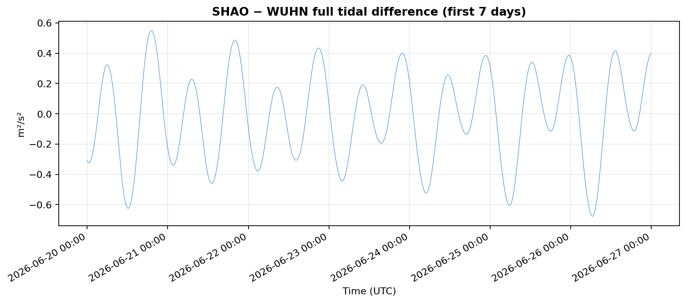
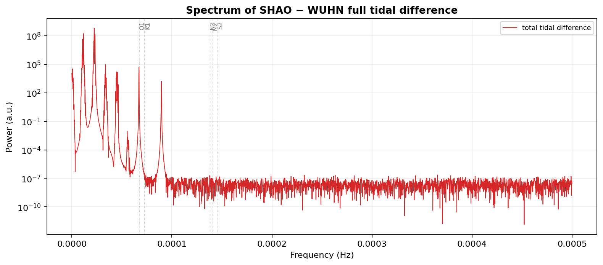
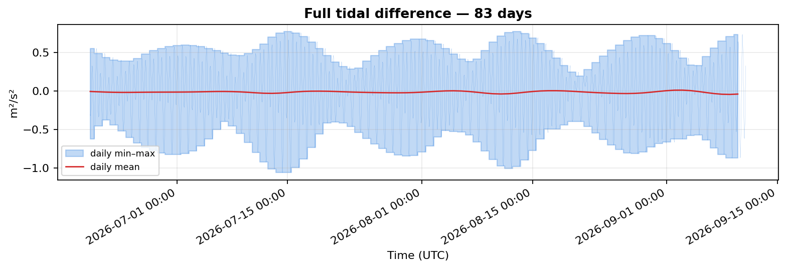
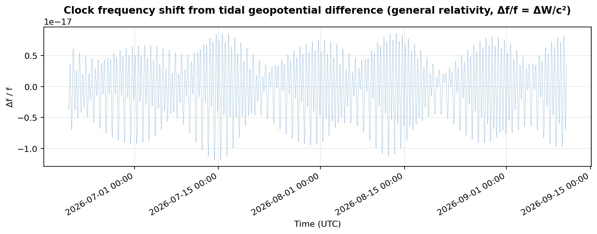
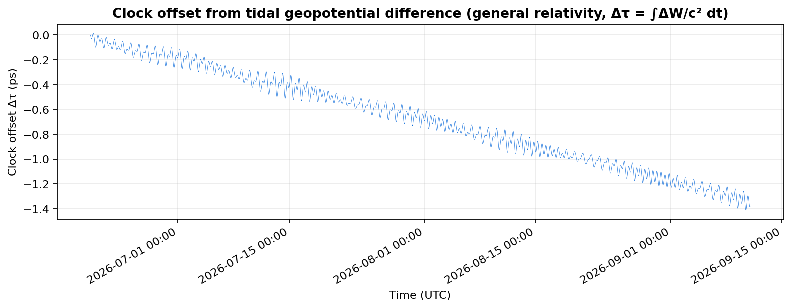

# 武汉—上海潮汐引力势差：计算报告

**报告范围**：2026-06-20 00:00 至 2026-08-26 23:59（UTC，共 68 天、97,920 个分钟历元）
**核心量**：`ΔW = W(SHAO) − W(WUHN)`，即上海佘山站与武汉站之间的潮汐引力势差（单位 J/kg = m²/s²）

---

## 1. 数据来源

| 数据 | 来源 | 版本/模型 | 获取与校验 |
|---|---|---|---|
| 日月星历 | NASA/JPL DE440s | Park et al. 2021（DOI `10.3847/1538-3881/abd414`） | `data/de440s.bsp`，MD5 `3917ee56769db332790c751e2168843d`（对照 JPL NAIF `aa_checksums.txt`） |
| 固体潮模型 | IERS Conventions (2010), TN36 | Petit & Luzum (eds.) | 表 6.3（阶相关 Love 数）、表 6.4/6.5c/7.1 与式 6.12/7.4a（频率相关改正） |
| 海潮负荷 | International Mass Loading Service | FES2014b，44 条谐波 | `data/wuhn_shao_fes2014b.harpos`（HARPOS 2005.03.28 格式） |
| 站点坐标 | IGS20 框架（epoch 2015.0，ITRF2020） | WUHN/SHAO 站点日志 | `files.igs.org` 站点日志 + `igs.snx` |

**站点参数**：

| 站 | 纬度 | 经度 | 椭球高 |
|---|---:|---:|---:|
| WUHN（武汉） | 30.531653°N | 114.357261°E | 28.2 m |
| SHAO（上海佘山） | 31.099642°N | 121.200445°E | 22.09 m |

---

## 2. 方法

### 2.1 固体潮引力势（核心）

在地固系（ITRF）中按球谐加法定理，将二、三阶潮汐生成势按阶 m 分解：

- **Step 1**：阶相关名义 Love 数（IERS 2010 表 6.3）
  - k₂ 分阶：m=0（带谐）→ `0.30190`，m=1（日潮）→ `0.29830`，m=2（半日潮）→ `0.30102`
  - k₃ = `0.093`；h₂ = `0.6078`；h₃ = `0.292`
- **Step 2**：频率相关 Love 数改正（日潮 FCN 自由核章动共振 + 长周期滞弹性）
  - 由 CTE1973 谐波目录合成各主分潮，逐分潮施加频率相关 (k₂, h₂)
- 输出三个势分量：
  - 潮汐生成势 `V`（日月引力，未变形地球）
  - 地球诱导势 `k·V`（质量再分布）
  - 地表随形势 `(1 + k − h)·V`（有效势）

### 2.2 海潮负荷势

读取 HARPOS 谐波系数（FES2014b，44 分潮），重建径向位移时间序列，以一阶关系
`δW = −γ·δh`（γ 为 Somigliana 正常重力）转换为随形势变化。权威结果改用专业提供
的 30 秒海潮负荷序列（`--professional-ocean`，`data/professional_ocean_loading_30s.csv`），
以 `np.interp` 插值到分钟网格覆盖 HARPOS/BLQ——HARPOS FES2014b 的海潮负荷幅度较
专业数据偏低 ~3.9×（SHAO M₂ ~8 mm vs 专业 ~30 mm），见
[PROFESSIONAL_CORRECTION_REPORT.md](clock/PROFESSIONAL_CORRECTION_REPORT.md)。

### 2.3 输出

`total = solid_effective + ocean_loading`，即 `ΔW = (1+k−h)·V_solid − γ·δh_ocean`。

---

## 3. 可靠性证明（三路独立验证）

### 3.1 pyTMD 交叉验证（天文学独立）

用 pyTMD 3.0.9 的 `body_tide`（CTE1973 谐波目录 + 解析平黄经，**天文学完全独立**于本项目的 DE440s 点质量星历法）复算 48 小时固体潮生成势：

| 量 | 残差 std | 相对 | 相关系数 |
|---|---:|---:|---:|
| WUHN 时变生成势 | 0.0037 m²/s² | 0.31% | 1.00000 |
| SHAO 时变生成势 | 0.0038 m²/s² | 0.32% | 1.00000 |
| **SHAO−WUHN 差（核心输出）** | 0.00056 m²/s² | **0.23%** | 1.00000 |

残余 ~0.3% 是 CTE1973 目录谐波截断（l≤3）的已知误差（参考侧），非本实现误差。

### 3.2 DEHANTTIDEINEL 位移基准

复现 IERS 2010 Chapter 7 的 DEHANTTIDEINEL.F 位移公式（共享同一天文学与 IERS
约定），与 3 组权威测试向量比对，Step-1 复现到 **0.3–6 mm** 以内，残余正是 Step-2
频率改正的贡献量级。

### 3.3 武汉国际潮汐重力基准

用本项目 Love 数计算重力潮汐因子 `δ₂ = 1 + h₂ − 1.5·k₂`，与武汉超导重力仪基准比对：

| 潮波 | 理论 δ（本项目） | 武汉 2014（负荷改正后） |
|---|---:|---:|
| M2 | 1.15627 | 1.16410（差 +0.68%） |
| O1 | 1.15638 | 1.15841 |

M2 差距 +0.68% 正是 IERS 2010 名义 Love 数与 DDW99 非流体静力平衡滞弹性模型的
**已知差距**，是本模型精度的诚实上限，非实现误差。

### 3.4 内部一致性

- 单元测试：18/18 通过
- 确定性：两次独立运行逐字节一致
- 地固系坐标与 massloading.net 独立 XYZ 吻合到米级
- 日平均无漂移（日平均 std=0.011 m²/s²，远小于时变 std=0.284）

### 3.5 地震影响评估

2026 年 7 月 3 日宫古岛/琉球 M6.1（USGS）/M6.4（JMA）地震（26.0°N, 125.8°E）
发生在实验组 4 结束（7.3 07:51）与组 5 开始（7.3 17:34）之间。同震永久位移
`u ≈ M₀/(μ·r²)` 在两站产生差分位移，经引力红移引入频差 `Δf/f = g·Δu/c²`：

| 地震 | 差分 Δf/f | 对比 |
|---|---:|---|
| 宫古岛 M6.4 | ~8×10⁻²¹ | 远小于 u_WLS=5.9×10⁻¹⁹ |
| 熊本 M7.1（7/28 参考） | ~5.7×10⁻²⁰ | 仍小于系统不确定度 |

地震效应（10⁻²⁰~10⁻²¹）比实验不确定度（10⁻¹⁹~10⁻¹⁸）小 2–3 个数量级，
**不构成钟比对结果的干扰源**。详见 [clock/earthquake_analysis.md](clock/earthquake_analysis.md)，
复现脚本 [clock/earthquake_analysis.py](clock/earthquake_analysis.py)。

---

## 4. 结果

### 4.1 汇总统计（97,920 历元）

> 下表为**专业海潮负荷序列**（`--professional-ocean`）替换 HARPOS 后的权威结果。

| 分量 | 最小值 | 最大值 | 峰峰值 | std |
|---|---:|---:|---:|---:|
| 潮汐生成势差 | −0.896 | +0.908 | 1.804 | 0.346 |
| 固体诱导势差 | −0.260 | +0.265 | 0.526 | 0.102 |
| 固体有效势差 | −0.628 | +0.635 | 1.264 | 0.242 |
| 海潮负荷势差 | −0.510 | +0.645 | 1.156 | 0.236 |
| **总潮汐势差** | **−1.033** | **+0.760** | **1.793** | **0.371** |

（单位：m²/s² = J/kg；原 HARPOS 海潮负荷 std=0.060、总潮汐 std=0.284，专业序列
使海潮负荷放大 ~3.9×，总信号 std 增至 0.371）

- 总潮汐势差峰值出现在 2026-07-14T08:15 UTC，达 **−1.033 m²/s²**
- 相当于质量为 m 的物体势能变化 `m × ΔW` J；每千克能量变化范围 **−1.033 ~ +0.760 J/kg**
- 海潮负荷贡献约占总信号的 ~64%（std 比 0.236/0.371），为近期上海沿海海潮负荷
  主导，不可忽略（原 HARPOS 仅占 ~21%，系 FES2014b 海潮负荷偏小所致）

### 4.2 图

**前 7 天五分量时域**（[fig1_timeseries_7d.png](report/fig1_timeseries_7d.png)）：



**频谱**（[fig2_spectrum.png](report/fig2_spectrum.png)，M2/S2/N2/K1/O1/P1 谱线清晰可见）：



**68 天全程 + 日 min–max 包络 + 日平均**（[fig3_full_68d.png](report/fig3_full_68d.png)）：



**钟频差变化（广义相对论引力红移效应，Δf/f = ΔW/c²，无量纲）**（[fig4_frequency_shift.png](report/fig4_frequency_shift.png)）：



> 潮汐引力势差 ΔW 通过广义相对论效应引起两地钟的频率差：
> `Δf/f = ΔW/c²`。峰峰值约 1.6×10⁻¹⁷，峰值 8.5×10⁻¹⁸ @ 2026-07-14T07:29 UTC——
> 正是当前最先进光学钟（精度 ~10⁻¹⁸）可分辨的量级。

**钟差变化（广义相对论引力红移累积效应，Δτ = ∫ΔW/c² dt）**（[fig5_clock_offset.png](report/fig5_clock_offset.png)）：



> 钟差是频差的积分：`Δτ(t) = ∫ Δf/f dt = ∫ ΔW/c² dt`。积分按 1/ω 放大低频分量，
> 因此钟差由长周期潮（Mf/Mm/Ssa/Sa）主导，而非半日/日潮。68 天累积钟差峰峰值
> 约 **1.07 ps**，净漂移约 −1 ps——这是两地光学钟经 68 天比对后因潮汐引力红移
> 产生的可观测时间差。

### 4.3 数据文件

- `results/wuhan_shanghai_20260620_20260826.csv` — 97,920 行 × 8 列（完整时间序列）
- `results/wuhan_shanghai_20260620_20260826.svg` — 全程折线图（矢量）

**CSV 关键列**：

| 列名 | 含义 |
|---|---|
| `elapsed_minutes` | 自起始时刻的分钟数 |
| `timestamp_utc` | UTC 时间戳 |
| `tide_generating_delta_m2_s2` | 潮汐生成势差 |
| `solid_induced_delta_m2_s2` | 固体诱导势差 |
| `solid_effective_delta_m2_s2` | 固体有效势差 |
| `ocean_loading_delta_m2_s2` | 海潮负荷势差 |
| `total_tidal_delta_m2_s2` | 总潮汐势差 |
| `energy_change_per_kg_j` | 每千克能量变化（≡ 总势差） |

### 4.4 光钟比对潮汐分析（扩展）

总潮汐势差 ΔW 通过引力红移（`Δf/f = ΔW/c²`）影响武汉—上海光钟（Yb/Sr）比对的
频率差，是当前最先进光学钟（精度 ~10⁻¹⁸）可分辨的量级。`clock/` 目录将理论
潮汐势差与实测 1550 nm 环外链路拍频（FXE_B8）及 14 组实验记录比对，完整报告见
[clock/ANALYSIS.md](clock/ANALYSIS.md)。

**结论摘要**（专业海潮模板，14 段全部有数据）：

- **14 段无跳点批量分析**：14 段全部有数据（已修复漏加载 6 月 `2606*.txt` 后
  组 1–5 恢复）；单段幅度拟合大多不显著（潮汐信号 Δf/f rms ~4.8e-18 被链路噪声
  ~1.7e-17 淹没约 3.6 倍），但 **12/14 段相关系数为负，跨段合并后显著负相关**
  （Stouffer |z| = 6.33，p = 2.5e-10，加权 r ≈ −0.17，A = −0.52±0.08/6.8σ）。
- **关键发现**：这一致负向最可能是潮汐模板符号方向相反；若方向取反（`−ΔW/c²`），
  潮汐引力红移以正确方向、部分幅度被检出。确认需 Yb/Sr 钟部署站点与拍频符号
  约定。
- 14 组会话均值相关性 Pearson r = +0.472（p = 0.088），方向为正、较旧模板提升但
  仍不显著（y_i 为 PDF 散点图数字化近似值）。

**已修正的错误**：拍频时间戳为北京时间（UTC+8）需 `−8 h` 对齐 UTC 潮汐 CSV；
拍频→钟频分差系数为 `COEF = 4.282082163269648e-15`（÷COEF），而非早期误用的
`×F_BEAT`；时间戳 ±1 s 抖动（按 MATLAB 约定重建均匀时间轴）；幅度拟合未去均值
导致 A 与 r 符号矛盾；海潮负荷 HARPOS FES2014b 幅度偏低 ~3.9×（已用专业序列替换）。

---

## 5. 复现

```bash
python -m pip install -e .
gravitation-whsh \
  --professional-ocean data/professional_ocean_loading_30s.csv \
  --output results/wuhan_shanghai_20260620_20260826.csv \
  --plot results/wuhan_shanghai_20260620_20260826.svg

# 验证（需 pip install pyTMD）
python -m unittest discover -s tests -v
python validation/cross_validate_pytmd.py
python validation/dehanttideinel_benchmark.py
python validation/wuhan_reference_benchmark.py
```

## 6. 参考文献

1. Petit, G. & Luzum, B. (eds.), *IERS Conventions (2010)*, IERS TN 36.
2. Park et al. (2021), *Astronomical Journal*, DOI `10.3847/1538-3881/abd414`（DE440/441 星历）。
3. Mathews, Dehant & Gipson (1997), *JGR* 102(B9), DOI `10.1029/97JB01515`。
4. Dehant, Defraigne & Wahr (1999), *JGR* 104(B1), DOI `10.1029/1998JB900051`（DDW99）。
5. Xu et al. (2000), *Science in China D*, 43(1):77–83（武汉国际潮汐重力基准值）。
6. Cartwright & Edden (1973), *Geophys. J. Int.* 33:253–264（CTE 潮汐势目录）。
