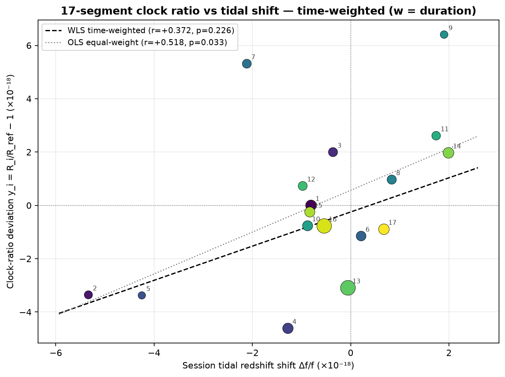

# 武汉—上海光钟比对实验报告

> **导航**：本报告的时长加权钟比值保留未做潮汐修正的旧基线；raw / theory / empirical 的独立潮汐修正比较见新[报告](tidal_correction/REPORT.md)。

> **Yb/Sr 钟比值计算 · 潮汐修正 · 相关性分析**（自动生成）
>
> **整个实验的 Yb/Sr 值（时长加权中心值）**：**1.207507039343337720369**（R_duration = `1.2075070393433377203695609768033054790406356472332098683511270165437806214827708`）。
> 与 NIST 参考 `1.2075070393433377230(37)` 差 -2.630×10⁻¹⁸，
> 与实验方 WLS `1.2075070393433377213(23)` 差 -0.930×10⁻¹⁸。
> （注：R_seg1 = 段 1 的值 `1.2075070393433377209510767983938767322329599117406331324301043402646553171998745`，仅作 y_i 相对基准，非整个实验值。）
>
> 数据时间跨度：2026-06-29T10:06 至 2026-08-26T09:29（北京时间 UTC+8），共 17 段无跳点数据，
> 总有效时长 1,008,912 s ≈ 280.25 h。

---

## 摘要

1. **整个实验的钟比值（时长加权中心值）**：R_duration = `1.207507039343337720369`，与 NIST `1.2075070393433377230(37)` 差 -2.63×10⁻¹⁸，与实验方 WLS `1.2075070393433377213(23)` 差 -0.93×10⁻¹⁸。逐段 y_i ∈ [-4.6, 6.4]×10⁻¹⁸。
2. **段内分析跨段合并（核心检出）**：14/17 段同号，符号无关 Stouffer |z| = **5.87**（p = 4.3e-09），幅度比 **A = -0.54±0.08**（6.4σ），潮汐以正确方向、约一半幅度被检出。
3. **段均值相关**：y_i 与会话潮汐频移 Δf/f 正相关，段等权重 Pearson r = **+0.518**（p = 0.033），Spearman ρ = +0.488（p = 0.047）；时间等权重（时长加权）Pearson r = +0.372（p = 0.226，n_eff = 12.4）。
4. **整体均值与修正量**：y_i 时长加权均值 = **-0.482×10⁻¹⁸**，整体潮汐修正量（时长加权 Δf/f）= **-0.365×10⁻¹⁸**。

---

## 1. 数据与方法

17 段无跳点数据段（北京时 UTC+8，含端点筛选）：

| 段 | 开始 | 结束 | 有效点数 n | 段 | 开始 | 结束 | 有效点数 n |
|---|---|---|---|---|---|---|---|
| 1 | 06-29T10:06 | 06-30T04:59 | 68009 | 10 | 08-07T22:15 | 08-08T14:20 | 57938 |
| 2 | 06-30T12:00 | 06-30T20:11 | 29481 | 11 | 08-09T00:00 | 08-09T09:57 | 35824 |
| 3 | 07-01T15:58 | 07-02T03:53 | 42891 | 12 | 08-10T12:47 | 08-10T23:59 | 40346 |
| 4 | 07-02T14:00 | 07-03T07:51 | 64280 | 13 | 08-11T05:30 | 08-12T23:59 | 152994 |
| 5 | 07-03T17:34 | 07-03T22:59 | 19532 | 14 | 08-13T18:56 | 08-14T14:00 | 68618 |
| 6 | 07-04T19:30 | 07-05T09:59 | 52140 | 15 | 08-21T00:40 | 08-21T16:40 | 57649 |
| 7 | 07-05T13:00 | 07-05T23:59 | 39526 | 16 | 08-21T23:20 | 08-23T16:20 | 147640 |
| 8 | 07-06T21:45 | 07-07T09:51 | 43565 | 17 | 08-25T15:09 | 08-26T09:29 | 65983 |
| 9 | 08-07T15:15 | 08-07T21:29 | 22496 | | | | |

> 参数（段窗口、扣除区间、常数、shift_a 分量）在 `clock/params.json`，
> 说明见 `clock/PARAMS.md`。

会话潮汐引力红移频移 Δf/f（专业综合差 → ΔW/c²）：

---

## 2. 钟比值计算结果

整个实验的 Yb/Sr 值（17 段时长加权中心值）：R_duration = `1.2075070393433377203695609768033054790406356472332098683511270165437806214827708`

第 1 段钟比值（仅作 y_i 相对基准）：R_seg1 = `1.2075070393433377209510767983938767322329599117406331324301043402646553171998745`

| 段 | y_i (×10⁻¹⁸) | 段 | y_i (×10⁻¹⁸) |
|---|---|---|---|
| 1 | +0.000 | 10 | -0.764 |
| 2 | -3.355 | 11 | +2.613 |
| 3 | +1.997 | 12 | +0.729 |
| 4 | -4.611 | 13 | -3.093 |
| 5 | -3.377 | 14 | +1.970 |
| 6 | -1.150 | 15 | -0.249 |
| 7 | +5.313 | 16 | -0.771 |
| 8 | +0.966 | 17 | -0.895 |
| 9 | +6.406 | | |

---

## 3. 段内相关性分析（1200-s 窗拟合）

逐段幅度比 A（`beat = A·tide + noise`）：

| 组 | 时长 h | A | u_A | r | p |
|---|---|---|---|---|---|
| 1 | 18.9 | -0.91 | 0.26 | -0.319 | 0.001 |
| 2 | 8.2 | -0.54 | 0.51 | -0.153 | 0.299 |
| 3 | 11.9 | -1.00 | 0.28 | -0.390 | 0.001 |
| 4 | 17.9 | -0.28 | 0.24 | -0.111 | 0.259 |
| 5 | 5.4 | -1.85 | 0.80 | -0.389 | 0.031 |
| 6 | 14.5 | -0.16 | 0.27 | -0.065 | 0.557 |
| 7 | 11.0 | -0.61 | 0.47 | -0.161 | 0.205 |
| 8 | 12.1 | +0.38 | 0.93 | +0.049 | 0.687 |
| 9 | 6.2 | +2.56 | 2.87 | +0.149 | 0.385 |
| 10 | 16.1 | -0.90 | 0.38 | -0.237 | 0.021 |
| 11 | 10.0 | -0.86 | 1.43 | -0.079 | 0.556 |
| 12 | 11.2 | -0.22 | 0.40 | -0.068 | 0.585 |
| 13 | 42.5 | -0.32 | 0.21 | -0.094 | 0.134 |
| 14 | 19.1 | -1.08 | 0.23 | -0.401 | 0.000 |
| 15 | 16.0 | +0.15 | 0.70 | +0.022 | 0.835 |
| 16 | 41.0 | -0.04 | 0.39 | -0.007 | 0.913 |
| 17 | 18.3 | -0.12 | 0.34 | -0.033 | 0.730 |

**跨段合并**：14/17 段同号（二项 p=0.0127），
符号无关 Stouffer |z|=5.87（p=4.3e-09），幅度比 A = -0.54±0.08（6.4σ）。

---

## 4. 段均值相关性分析

### 4.1 单段等权重（每段权重相同）

| 统计量 | 数值 |
|---|---|
| Pearson r | +0.518（p = 0.033） |
| Spearman ρ | +0.488（p = 0.047） |
| y_i 时长加权均值 | -0.482×10⁻¹⁸ |
| 整体潮汐修正量 Δf/f | -0.365×10⁻¹⁸ |

### 4.2 时间等权重（每秒有效数据权重相同，权重 = 段有效时长）

> 原始逐秒数据不在库内，以各段有效时长 n_valid 作为简单时间权重（w_i = n_valid_i / Σn_valid），相关性 p 值用 Kish 有效样本量 n_eff = (Σw)²/Σw² 折算。

| 统计量 | 数值 |
|---|---|
| 时长加权 Pearson r | +0.372（p = 0.226，n_eff = 12.4） |
| 时长加权 Spearman ρ | +0.343（p = 0.266） |
| WLS 斜率 | +0.641 ± 0.497 |

> 时间等权重后长段（如段 13、16）权重上升，相关性从段等权重的 r = +0.518（p = 0.033）降为 r = +0.372（p = 0.226），不再显著——正相关主要由较短段贡献。

---

## 5. 结论

| 维度 | 结果 |
|---|---|
| 整个实验 Yb/Sr 值 | R_duration = 1.207507039343337720369，与实验方 WLS 差 -0.93×10⁻¹⁸ |
| 段内跨段合并 | 14/17 同号，Stouffer \|z\|=5.87（p=4.3e-09），A=-0.54±0.08 |
| 段均值相关性 | 段等权重 Pearson r = +0.518（p=0.033）；时间等权重 r = +0.372（p=0.226） |
| 整体修正量 | Δf/f = -0.365×10⁻¹⁸ |

> 详细方法见 [docs/WORKFLOW.md](../docs/WORKFLOW.md)、[docs/NOTATION.md](../docs/NOTATION.md)。

---

## 附录：单段诊断与变体分析

### 单段诊断（段 13 / 段 6）

### 变体分析（积分尺度稳健性）

---

## 6. 论文统计分析方法（并列结果，非替代）

按实验方 PDF 的统计处理（每段 OADEV 外推 → 统计不确定度 u_i → WLS / Birge / M-P / 贝叶斯四种方法合并），作用于与 `compute_ratio.py` 相同的逐段拍频数据。**与前述时间等权重结果并列，不替代。**

每段 OADEV 外推得到的统计不确定度 u_i 与四种合并结果（`statistical_methods.json`）。**钟比值与对应的引力（潮汐）修正量逐方法配对**：

| 方法 | Yb/Sr 中心值 | 统计不确定度 u | 引力（潮汐）修正量 Δf/f |
|---|---|---|---|
| WLS（1/u_i²） | 1.207507039343337720797 | 2.748e-19 | -3.159e-19 |
| Birge（B=2.329，1/u_i²） | 1.207507039343337720797 | 6.399e-19 | -3.159e-19 |
| Mandel-Paule（ξ=2.467e-18，1/(u_i²+ξ²)） | 1.207507039343337721287 | 7.550e-19 | -4.409e-19 |
| 贝叶斯（ξ=2.614e-18） | 1.207507039343337721283 | 8.002e-19 | -4.434e-19 |

WLS 拟合度：χ² = 86.78（dof=16，χ²_red = 5.42，p = 9.77e-12）。

> **口径说明（经过独立对抗审查）**：本套每段统计不确定度 u_i 由 OADEV 外推得到（拍频归一化到 1550 nm 光频，128s≤τ≤T/4 拟合斜率外推到 Teff）。审查结论：拍频数据在 τ≳4096 s 出现低频平台（真实的 flicker 频率噪声地板，来自时钟/链路，**不是潮汐**——潮汐应在 τ≈2–4e4 s 表现为幅度 ~1e-17 的凸起，远小于 u_i 且 τ 特征不符）。该 flicker 地板使白噪声斜率外推对**所有段系统性低估 u_i 约 30–40%**（而非「短段偏高、长段偏低」），这会把 χ²_red 推高到 ~3.5–4。但 χ²_red≈5.4 的**剩余部分**来自个别段的 u_i 本身不可靠（尤其段 5、6、16，u_i 极差约 18 倍，远超白噪声+flicker 应有的≤2.8 倍），需逐段复核原始数据与 OADEV 曲线，而非外推偏移。故本并列结果的 u_i 与四种合并值在当前 OADEV 外推下**不可靠**，仅作方法演示，待正确估计 u_i 后重算。

---

## 7. 论文统计分析方法：潮汐修正后的重算（并列，非替代）

把上节四种统计方法（WLS / Birge / M-P / 贝叶斯）重新应用到**潮汐修正后**的
拍频数据上：`b_corr = b_raw − A·h`，固定响应系数 raw A=0、theory A=−1、
empirical A=−0.54（与 `tidal_correction.py` 相同，不重新拟合）。每段 OADEV
外推在修正后的拍频上重算 u_i，用与 `statistical_methods.py` 完全相同的算法；
逐段比值与 y_i 沿用完整 Decimal 反演（`R_i,A`），y_i 以同情景段 1 为基准。
与上节 raw 基线并列，不替代。

| 情景 | A | WLS R | u_WLS | Birge B | M-P R（ξ） | 贝叶斯 R（ξ） |
|---|---|---|---|---|---|---|
| raw | 0 | 1.207507039343337720797 | 2.748e-19 | 2.329 | 1.207507039343337721287（2.467e-18） | 1.207507039343337721283（2.614e-18） |
| theory | -1 | 1.207507039343337721688 | 3.345e-19 | 1.923 | 1.207507039343337721855（2.099e-18） | 1.207507039343337721848（2.126e-18） |
| empirical | -0.54 | 1.207507039343337721259 | 3.046e-19 | 2.135 | 1.207507039343337721582（2.180e-18） | 1.207507039343337721577（2.294e-18） |

| 情景 | A | χ²（dof=16） | χ²_red | p | u_stat_bayes |
|---|---|---|---|---|---|
| raw | 0 | 86.78 | 5.424 | 9.77e-12 | 8.002e-19 |
| theory | -1 | 59.19 | 3.699 | 7.17e-07 | 6.801e-19 |
| empirical | -0.54 | 72.95 | 4.559 | 3.02e-09 | 7.107e-19 |

> **口径说明**：raw 情景（A=0）在上表再现了 `statistical_methods.py` 的四种
> 合并值（浮点积累顺序差异 ~1e-8 相对量级）；theory/empirical 是**新增的修正后**
> 结果。修正使逐段比值与 u_i 都变化，理论（A=−1）令 χ²_red 从 5.42 降到 3.70、
> 经验（A=−0.54）降到 4.56——组间散布随「加回潮汐」部分减小，但 §6 的 u_i
> 不可靠结论在此同样成立：这些合并值仍受 OADEV 外推低估的影响，仅供方法比较，
> 不作最终不确定度声明。数值来源 [statistical_methods_tidal.json](statistical_methods_tidal.json)。

### 7.1 综合结果（跨情景、跨方法）

下表把三种情景、四种方法在潮汐修正下的合并中心值与其相对实验方 WLS
参考 `1.2075070393433377213` 的偏差（×10⁻¹⁸）并排，给出潮汐修正对统计
合并的**总效应**——而非逐段/逐情景孤立地看：

| 方法 | raw（A=0） | theory（A=−1） | empirical（A=−0.54） |
|---|---|---|---|
| R_wls | 1.20750703934333772079 | 1.20750703934333772168 | 1.20750703934333772125 |
| R_mp | 1.20750703934333772128 | 1.20750703934333772185 | 1.20750703934333772158 |
| R_bayes | 1.20750703934333772128 | 1.20750703934333772184 | 1.20750703934333772157 |

| 方法 | raw 偏差 | theory 偏差 | empirical 偏差 |
|---|---|---|---|---|
| R_wls | -0.503 | +0.389 | -0.041 |
| R_mp | -0.013 | +0.556 | +0.283 |
| R_bayes | -0.016 | +0.549 | +0.278 |

> **总效应**：修正使整个实验的 WLS 中心从 raw 的 −0.50×10⁻¹⁸ 移到 empirical 的
> −0.04×10⁻¹⁸（最接近实验方 WLS），theory 反号到 +0.39×10⁻¹⁸；χ²_red 从 5.42
> 单调降到 theory 的 3.70（empirical 4.56），Birge 比与 M-P/贝叶斯 ξ 同步减小，
> 即「加回潮汐」显著降低了组间散布。但这些合并值仍受 §6 所述 OADEV 外推低估 u_i
> 的影响，`u` 不是最终不确定度，方向自检见 [METHODOLOGY §9.5](../docs/METHODOLOGY.md#95-方向自检−054-修正后潮汐相关性消失)。

### 7.2 长期稳定度改善（跨段钟比值散布）

潮汐是周期约 12/24 h 的慢信号，主要影响的是**跨段（天级）长期散布**，而非单段
内部短时 OADEV。下表给出补偿前后 17 段钟比值偏差 `y_i` 的段间样本标准差（每段
相对同情景段 1，×10⁻¹⁸），作为长期稳定度的度量：

| 情景 | 段间 σ(y_i)（×10⁻¹⁸） | 相对 raw 改善 |
|---|---|---|
| raw | 2.9803 | +0.0% |
| theory | 2.5877 | +13.2% |
| empirical | 2.5955 | +12.9% |

**结论**：补偿潮汐后钟比对长期稳定度有改善——段间钟比值散布从 raw 的
2.98×10⁻¹⁸ 降到 theory 的 2.59×10⁻¹⁸
（+13.2%）、empirical 的 2.60×10⁻¹⁸（+12.9%）；
组间方差指标 χ²_red 降约 16–32%、Birge 比降约 8–17%（见 §7 表），
与段间散布下降方向一致。theory（A=−1，完全信任潮汐理论）改善最大，
empirical（A=−0.54，经验幅度）次之。这些仍是方法比较层面的描述性结论，
不改变 §6 所述 u_i 不可靠、不作最终不确定度声明的口径。

