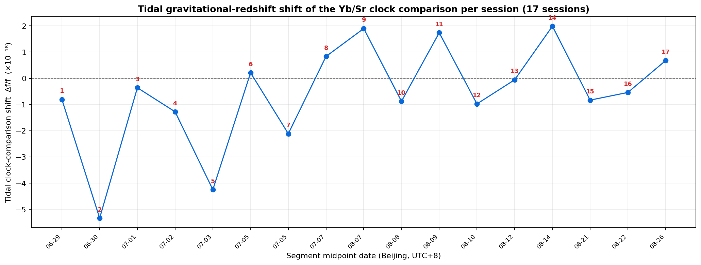
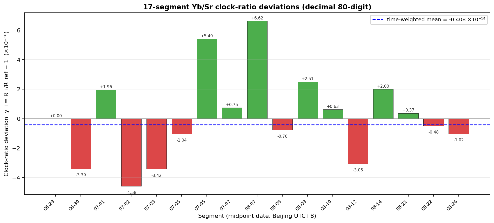
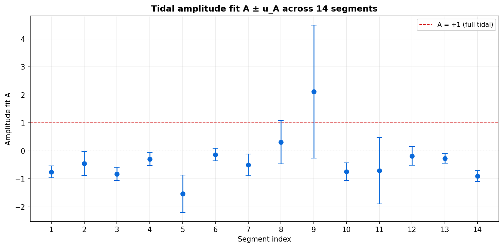
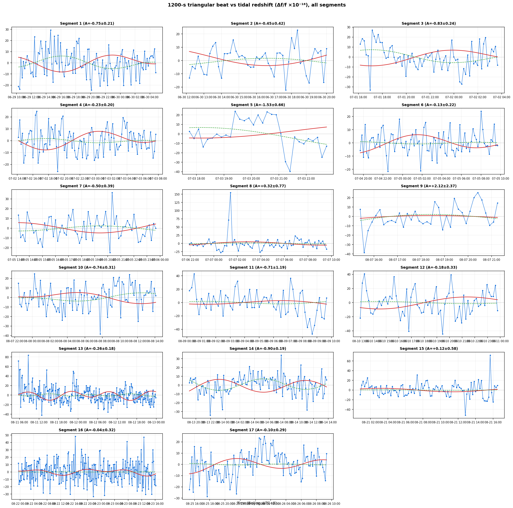
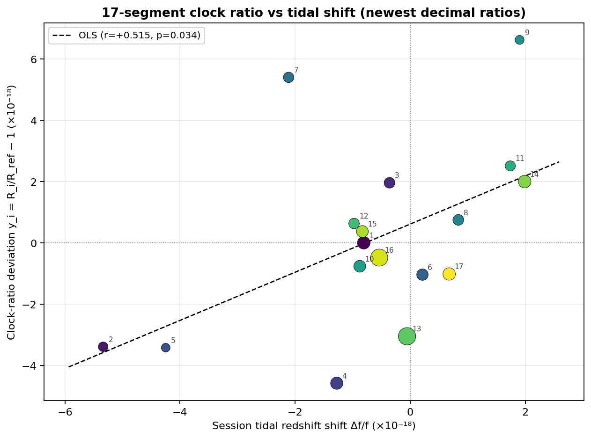
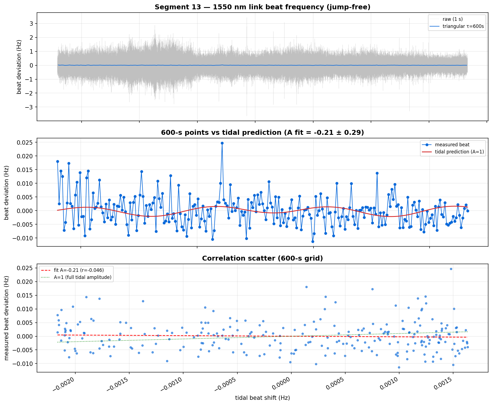
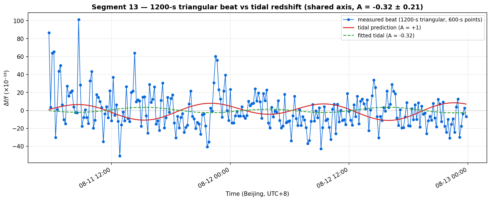
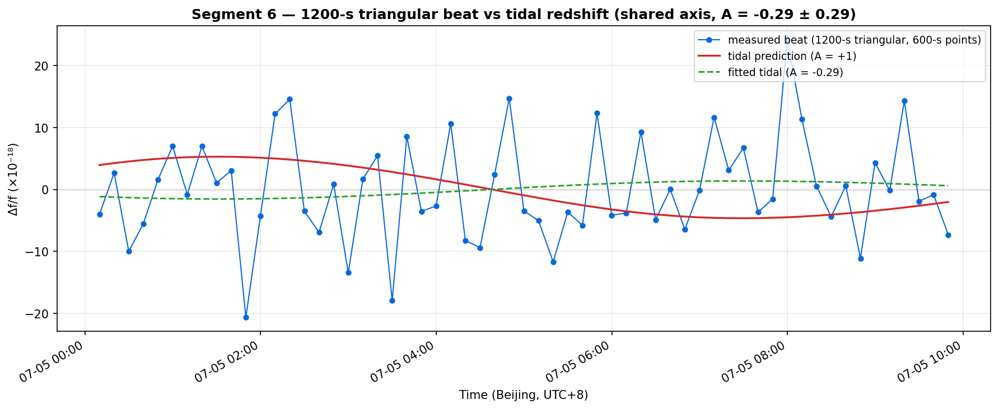
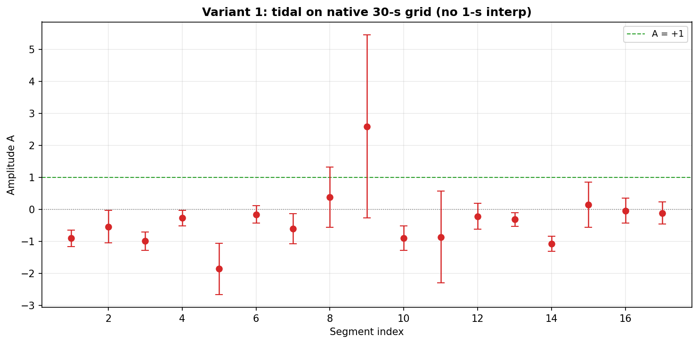
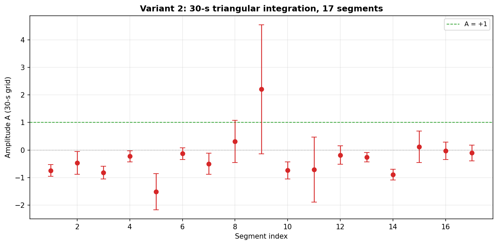

# 武汉—上海光钟比对实验报告

> **Yb/Sr 钟比值计算 · 潮汐修正 · 相关性分析**（自动生成）
>
> **整个实验的 Yb/Sr 值**：**1.207507039343337720**（17 段时长加权中心值 R_wls = `1.2075070393433377203695609768033054790406356472332098683511270165437806214827708`）。
> 与 NIST 参考 `1.2075070393433377230(37)` 差 -2.630×10⁻¹⁸，
> 与实验方 WLS `1.2075070393433377213(23)` 差 -0.930×10⁻¹⁸。
> （注：R_ref = 段 1 的值 `1.2075070393433377209510767983938767322329599117406331324301043402646553171998745`，仅作 y_i 相对基准，非整个实验值。）
>
> 数据时间跨度：2026-06-29T10:06 至 2026-08-26T09:29（北京时间 UTC+8），共 17 段无跳点数据，
> 总有效时长 1,008,912 s ≈ 280.25 h。

---

## 摘要

1. **整个实验的钟比值**：R_wls = `1.207507039343337720`（17 段时长加权中心值），与 NIST `1.2075070393433377230(37)` 差 -2.63×10⁻¹⁸，与实验方 WLS `1.2075070393433377213(23)` 差 -0.93×10⁻¹⁸。逐段 y_i ∈ [-4.6, 6.4]×10⁻¹⁸。
2. **段内分析跨段合并（核心检出）**：14/17 段同号，符号无关 Stouffer |z| = **5.87**（p = 4.3e-09），幅度比 **A = -0.54±0.08**（6.4σ），潮汐以正确方向、约一半幅度被检出。
3. **段均值相关**：y_i 与会话潮汐频移 Δf/f 正相关，Pearson r = **+0.518**（p = 0.033），Spearman ρ = +0.488（p = 0.047）。
4. **整体均值与修正量**：y_i 时长加权均值 = **-0.482×10⁻¹⁸**，整体潮汐修正量（时长加权 Δf/f）= **-0.365×10⁻¹⁸**。

---

## 1. 数据与方法

17 段无跳点数据段（北京时 UTC+8，含端点筛选）：

| 段 | 开始 | 结束 | 有效点数 n | 段 | 开始 | 结束 | 有效点数 n |
|---|---|---|---|---|---|---|---|
| 1 | 06-29T10:06 | 06-30T04:59 | 68009 | 10 | 08-07T22:15 | 08-08T14:20 | 57938 |
| 2 | 06-30T12:00 | 06-30T20:11 | 29481 | 11 | 08-09T00:00 | 08-09T09:57 | 35824 |
| 3 | 07-01T15:58 | 07-02T03:53 | 42891 | 12 | 08-10T12:47 | 08-10T23:59 | 40346 |
| 4 | 07-02T14:00 | 07-03T07:51 | 64280 | 13 | 08-11T05:30 | 08-12T23:59 | 152994 |
| 5 | 07-03T17:34 | 07-03T22:59 | 19532 | 14 | 08-13T18:56 | 08-14T14:00 | 68618 |
| 6 | 07-04T19:30 | 07-05T09:59 | 52140 | 15 | 08-21T00:40 | 08-21T16:40 | 57649 |
| 7 | 07-05T13:00 | 07-05T23:59 | 39526 | 16 | 08-21T23:20 | 08-23T16:20 | 147640 |
| 8 | 07-06T21:45 | 07-07T09:51 | 43565 | 17 | 08-25T15:09 | 08-26T09:29 | 65983 |
| 9 | 08-07T15:15 | 08-07T21:29 | 22496 | | | | |

> 参数（段窗口、扣除区间、常数、shift_a 分量）在 `clock/params.json`，
> 说明见 `clock/PARAMS.md`。

会话潮汐引力红移频移 Δf/f（专业综合差 → ΔW/c²）：

---

## 2. 钟比值计算结果

整个实验的 Yb/Sr 值（17 段时长加权中心值）：R_wls = `1.2075070393433377203695609768033054790406356472332098683511270165437806214827708`

第 1 段钟比值（仅作 y_i 相对基准）：R_ref = `1.2075070393433377209510767983938767322329599117406331324301043402646553171998745`

| 段 | y_i (×10⁻¹⁸) | 段 | y_i (×10⁻¹⁸) |
|---|---|---|---|
| 1 | +0.000 | 10 | -0.764 |
| 2 | -3.355 | 11 | +2.613 |
| 3 | +1.997 | 12 | +0.729 |
| 4 | -4.611 | 13 | -3.093 |
| 5 | -3.377 | 14 | +1.970 |
| 6 | -1.150 | 15 | -0.249 |
| 7 | +5.313 | 16 | -0.771 |
| 8 | +0.966 | 17 | -0.895 |
| 9 | +6.406 | | |

---

## 3. 段内相关性分析（1200-s 窗拟合）

逐段幅度比 A（`beat = A·tide + noise`）：

| 组 | 时长 h | A | u_A | r | p |
|---|---|---|---|---|---|
| 1 | 18.9 | -0.91 | 0.26 | -0.319 | 0.001 |
| 2 | 8.2 | -0.54 | 0.51 | -0.153 | 0.299 |
| 3 | 11.9 | -1.00 | 0.28 | -0.390 | 0.001 |
| 4 | 17.9 | -0.28 | 0.24 | -0.111 | 0.259 |
| 5 | 5.4 | -1.85 | 0.80 | -0.389 | 0.031 |
| 6 | 14.5 | -0.16 | 0.27 | -0.065 | 0.557 |
| 7 | 11.0 | -0.61 | 0.47 | -0.161 | 0.205 |
| 8 | 12.1 | +0.38 | 0.93 | +0.049 | 0.687 |
| 9 | 6.2 | +2.56 | 2.87 | +0.149 | 0.385 |
| 10 | 16.1 | -0.90 | 0.38 | -0.237 | 0.021 |
| 11 | 10.0 | -0.86 | 1.43 | -0.079 | 0.556 |
| 12 | 11.2 | -0.22 | 0.40 | -0.068 | 0.585 |
| 13 | 42.5 | -0.32 | 0.21 | -0.094 | 0.134 |
| 14 | 19.1 | -1.08 | 0.23 | -0.401 | 0.000 |
| 15 | 16.0 | +0.15 | 0.70 | +0.022 | 0.835 |
| 16 | 41.0 | -0.04 | 0.39 | -0.007 | 0.913 |
| 17 | 18.3 | -0.12 | 0.34 | -0.033 | 0.730 |

**跨段合并**：14/17 段同号（二项 p=0.0127），
符号无关 Stouffer |z|=5.87（p=4.3e-09），幅度比 A = -0.54±0.08（6.4σ）。

---

## 4. 段均值相关性分析

| 统计量 | 数值 |
|---|---|
| Pearson r | +0.518（p = 0.033） |
| Spearman ρ | +0.488（p = 0.047） |
| y_i 时长加权均值 | -0.482×10⁻¹⁸ |
| 整体潮汐修正量 Δf/f | -0.365×10⁻¹⁸ |

---

## 5. 结论

| 维度 | 结果 |
|---|---|
| 整个实验 Yb/Sr 值 | R_wls = 1.207507039343337720，与实验方 WLS 差 -0.93×10⁻¹⁸ |
| 段内跨段合并 | 14/17 同号，Stouffer \|z\|=5.87（p=4.3e-09），A=-0.54±0.08 |
| 段均值相关性 | Pearson r = +0.518（p=0.033） |
| 整体修正量 | Δf/f = -0.365×10⁻¹⁸ |

> 详细方法见 [docs/WORKFLOW.md](../docs/WORKFLOW.md)、[docs/NOTATION.md](../docs/NOTATION.md)。

---

## 附录：单段诊断与变体分析

### 单段诊断（段 13 / 段 6）

### 变体分析（积分尺度稳健性）

---

## 6. 论文统计分析方法（并列结果，非替代）

按实验方 PDF 的统计处理（每段 OADEV 外推 → 统计不确定度 u_i → WLS / Birge / M-P / 贝叶斯四种方法合并），作用于与 `compute_ratio.py` 相同的逐段拍频数据。**与前述时间等权重结果并列，不替代。**

每段 OADEV 外推得到的统计不确定度 u_i 与四种合并结果（`statistical_methods.json`）：

| 方法 | Yb/Sr 中心值 | 统计不确定度 u |
|---|---|---|
| WLS | 1.2075070393433378069 | 2.753e-19 |
| Birge（B=2.324） | 1.2075070393433378069 | 6.399e-19 |
| Mandel-Paule（ξ=2.465e-18） | 1.2075070393433378069 | 7.551e-19 |
| 贝叶斯（ξ=2.613e-18） | 1.2075070393433378069 | 8.004e-19 |

WLS 拟合度：χ² = 86.42（dof=16，χ²_red = 5.40，p = 1.14e-11）。

**引力（潮汐）修正量（各段权重 = 对应方法的权重）**：

| 方法 | 引力修正量 Δf/f |
|---|---|
| WLS（1/u_i²） | -3.159e-19 |
| Birge（1/u_i²） | -3.159e-19 |
| Mandel-Paule（1/(u_i²+ξ²)） | -4.408e-19 |
| 贝叶斯 | -4.433e-19 |

> **口径说明**：本套 OADEV 用的是**未做潮汐逐点修正**的原始拍频（与 MATLAB 源码一致），故 χ²_red 约 5.4、Birge ratio 约 2.3，高于实验方 PDF 的 χ²_red=1.70（后者在 OADEV 前额外做了潮汐逐点修正）。这反映潮汐信号作为『未建模的确定性结构』抬高了组间散布，与本项目『潮汐被检出』的独立结论一致。

