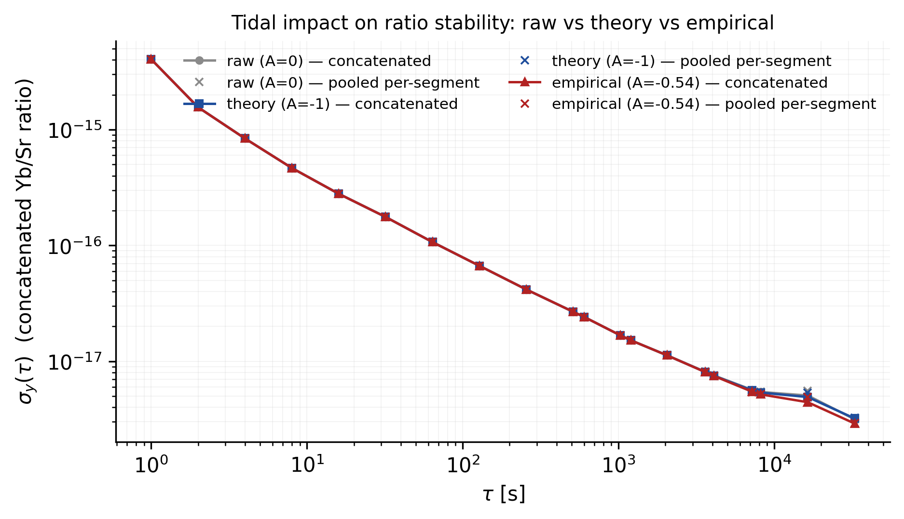

# Concatenated-stability assessment of the tidal impact

All **1,008,912** valid one-second samples from the 17 segments are joined into a single series; one gap-safe overlapping Allan deviation is computed per scenario. Real inter-segment gaps break the Allan pairs (never spliced).

The `pooled` column is the pair-count weighted pool of the existing per-segment OADEV ([tidal_correction/stability.csv](tidal_correction/stability.csv)). It agrees with the concatenated curve wherever the same segments contribute; the concatenated curve extends to longer tau because it is not truncated to a single segment's run//4.

## sigma_y(tau)  [concat | pooled per-segment]

| tau [s] | raw | theory (A=-1) | empirical (A=-0.54) | theory/raw | empirical/raw |
|---|---|---|---|---|---|
| 1 | 4.058e-15 / 4.058e-15 | 4.058e-15 / 4.058e-15 | 4.058e-15 / 4.058e-15 | 1.0000 | 1.0000 |
| 2 | 1.562e-15 / 1.562e-15 | 1.562e-15 / 1.562e-15 | 1.562e-15 / 1.562e-15 | 1.0000 | 1.0000 |
| 4 | 8.398e-16 / 8.398e-16 | 8.398e-16 / 8.398e-16 | 8.398e-16 / 8.398e-16 | 1.0000 | 1.0000 |
| 8 | 4.667e-16 / 4.667e-16 | 4.667e-16 / 4.667e-16 | 4.667e-16 / 4.667e-16 | 1.0000 | 1.0000 |
| 16 | 2.795e-16 / 2.795e-16 | 2.795e-16 / 2.795e-16 | 2.795e-16 / 2.795e-16 | 1.0000 | 1.0000 |
| 32 | 1.762e-16 / 1.762e-16 | 1.762e-16 / 1.762e-16 | 1.762e-16 / 1.762e-16 | 1.0000 | 1.0000 |
| 64 | 1.070e-16 / 1.070e-16 | 1.070e-16 / 1.070e-16 | 1.070e-16 / 1.070e-16 | 1.0000 | 1.0000 |
| 128 | 6.674e-17 / 6.674e-17 | 6.674e-17 / 6.674e-17 | 6.674e-17 / 6.674e-17 | 1.0000 | 1.0000 |
| 256 | 4.170e-17 / 4.170e-17 | 4.170e-17 / 4.170e-17 | 4.170e-17 / 4.170e-17 | 1.0000 | 1.0000 |
| 512 | 2.676e-17 / 2.676e-17 | 2.676e-17 / 2.676e-17 | 2.676e-17 / 2.676e-17 | 1.0000 | 1.0000 |
| 600 | 2.421e-17 / 2.421e-17 | 2.421e-17 / 2.421e-17 | 2.421e-17 / 2.421e-17 | 1.0000 | 1.0000 |
| 1024 | 1.680e-17 / 1.680e-17 | 1.680e-17 / 1.680e-17 | 1.680e-17 / 1.680e-17 | 0.9999 | 0.9998 |
| 1200 | 1.519e-17 / 1.519e-17 | 1.519e-17 / 1.519e-17 | 1.519e-17 / 1.519e-17 | 0.9998 | 0.9998 |
| 2048 | 1.127e-17 / 1.127e-17 | 1.126e-17 / 1.126e-17 | 1.126e-17 / 1.126e-17 | 0.9992 | 0.9989 |
| 3600 | 8.129e-18 / 8.129e-18 | 8.091e-18 / 8.091e-18 | 8.076e-18 / 8.076e-18 | 0.9953 | 0.9935 |
| 4096 | 7.550e-18 / 7.550e-18 | 7.498e-18 / 7.498e-18 | 7.477e-18 / 7.477e-18 | 0.9931 | 0.9904 |
| 7200 | 5.671e-18 / 5.610e-18 | 5.607e-18 / 5.576e-18 | 5.468e-18 / 5.421e-18 | 0.9886 | 0.9641 |
| 8192 | 5.437e-18 / 5.451e-18 | 5.371e-18 / 5.381e-18 | 5.182e-18 / 5.192e-18 | 0.9879 | 0.9531 |
| 16384 | 5.069e-18 / 5.550e-18 | 4.917e-18 / 5.336e-18 | 4.435e-18 / 4.921e-18 | 0.9702 | 0.8751 |
| 32768 | 3.161e-18 / 3.149e-18 | 3.211e-18 / 3.250e-18 | 2.905e-18 / 2.927e-18 | 1.0160 | 0.9189 |

## Summary at the longest common tau

- tau = 32768 s: raw = 3.161e-18, theory = 3.211e-18, empirical = 2.905e-18

> A ratio > 1 means the tidal correction LEFT MORE scatter than the raw data at that tau (i.e. the correction over-corrected there); < 1 means the correction reduced the scatter.

> Method: `b_corr = b_raw - A*h`, `h = F_1550*deltaW/c^2`, `y(t) = -q/(1+q)` (fractional ratio deviation). Gap-safe: pairs never cross a non-1 s step. OADEV is not SEM and no uncertainty is propagated.

