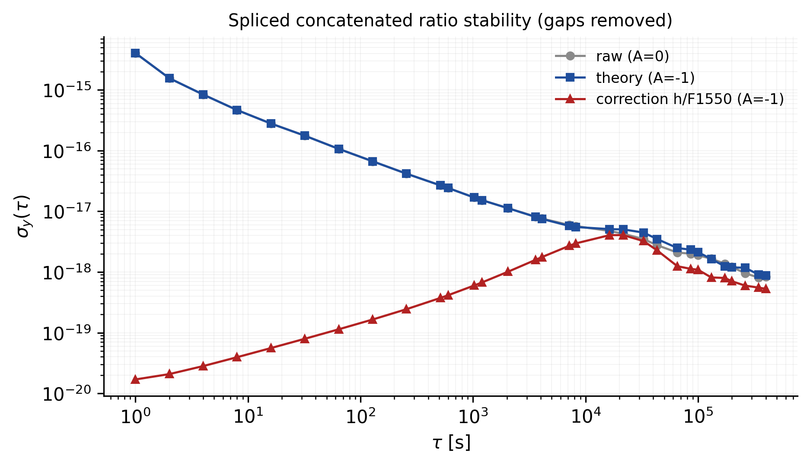

# Spliced concatenated stability (A=0, A=-1, A=-1 correction)

17 segments placed end-to-end on one continuous 1-s clock; the wall-clock gaps are removed. The aligned record spans **1,008,912** s (11.677 d of pure data time) versus 57.97 d of real elapsed time. One OADEV per series over the aligned axis.

| tau [s] | tau [d] | raw (A=0) | theory (A=-1) | correction h/F1550 | n_pairs |
|---|---|---|---|---|---|
| 1 | 0.000 | 4.058e-15 | 4.058e-15 | 1.695e-20 | 1008910 |
| 2 | 0.000 | 1.562e-15 | 1.562e-15 | 2.076e-20 | 1008908 |
| 4 | 0.000 | 8.398e-16 | 8.398e-16 | 2.814e-20 | 1008904 |
| 8 | 0.000 | 4.668e-16 | 4.668e-16 | 3.940e-20 | 1008896 |
| 16 | 0.000 | 2.796e-16 | 2.796e-16 | 5.575e-20 | 1008880 |
| 32 | 0.000 | 1.763e-16 | 1.763e-16 | 7.929e-20 | 1008848 |
| 64 | 0.001 | 1.070e-16 | 1.070e-16 | 1.136e-19 | 1008784 |
| 128 | 0.001 | 6.679e-17 | 6.679e-17 | 1.646e-19 | 1008656 |
| 256 | 0.003 | 4.174e-17 | 4.174e-17 | 2.436e-19 | 1008400 |
| 512 | 0.006 | 2.678e-17 | 2.679e-17 | 3.729e-19 | 1007888 |
| 600 | 0.007 | 2.425e-17 | 2.425e-17 | 4.137e-19 | 1007712 |
| 1024 | 0.012 | 1.689e-17 | 1.689e-17 | 5.985e-19 | 1006864 |
| 1200 | 0.014 | 1.528e-17 | 1.528e-17 | 6.718e-19 | 1006512 |
| 2048 | 0.024 | 1.128e-17 | 1.124e-17 | 1.010e-18 | 1004816 |
| 3600 | 0.042 | 8.159e-18 | 8.083e-18 | 1.586e-18 | 1001712 |
| 4096 | 0.047 | 7.591e-18 | 7.491e-18 | 1.759e-18 | 1000720 |
| 7200 | 0.083 | 5.940e-18 | 5.733e-18 | 2.709e-18 | 994512 |
| 8192 | 0.095 | 5.710e-18 | 5.513e-18 | 2.960e-18 | 992528 |
| 16384 | 0.190 | 4.744e-18 | 5.084e-18 | 4.049e-18 | 976144 |
| 21600 | 0.250 | 4.268e-18 | 5.035e-18 | 4.054e-18 | 965712 |
| 32768 | 0.379 | 3.491e-18 | 4.465e-18 | 3.234e-18 | 943376 |
| 43200 | 0.500 | 2.768e-18 | 3.497e-18 | 2.277e-18 | 922512 |
| 65536 | 0.759 | 2.094e-18 | 2.483e-18 | 1.244e-18 | 877840 |
| 86400 | 1.000 | 2.000e-18 | 2.329e-18 | 1.126e-18 | 836112 |
| 100000 | 1.157 | 1.883e-18 | 2.127e-18 | 1.089e-18 | 808912 |
| 131072 | 1.517 | 1.656e-18 | 1.633e-18 | 8.128e-19 | 746768 |
| 172800 | 2.000 | 1.371e-18 | 1.242e-18 | 7.980e-19 | 663312 |
| 200000 | 2.315 | 1.211e-18 | 1.190e-18 | 7.035e-19 | 608912 |
| 262144 | 3.034 | 9.548e-19 | 1.176e-18 | 5.964e-19 | 484624 |
| 345600 | 4.000 | 8.079e-19 | 9.037e-19 | 5.525e-19 | 317712 |
| 400000 | 4.630 | 8.364e-19 | 8.707e-19 | 5.276e-19 | 208912 |

> Gaps are removed, so the record is treated as contiguous. A tau longer than one raw segment is computable but mixes different campaigns; `n_pairs` records the number of adjacent m-averaged differences behind each point.

